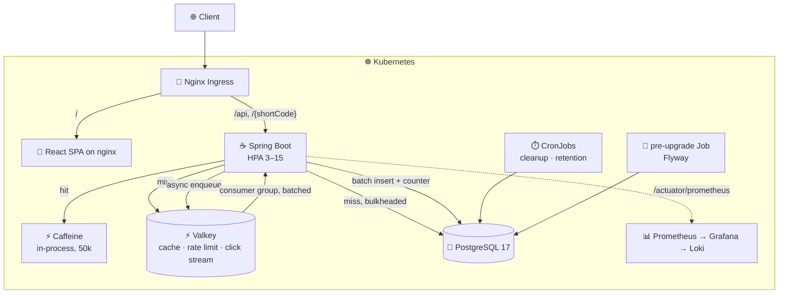

<h1 align="center">⚡ URL Shortener</h1>

<p align="center">
  Shorten a link, protect it, expire it, and see who clicked it —<br/>
  on a stack sized to keep serving while it is being abused.
</p>

<p align="center">
  
  
  
  
  
  <a href="./chart"></a>
  <a href="./load_tests"></a>
  <a href="./LICENSE"></a>
</p>

| Frontend | OpenAPI (Swagger) | Grafana |
| :---: | :---: | :---: |
|  |  |  |

---

## Features

**Links**

| | | Account |
| :-- | :-- | :--: |
| Short codes | TSID-based — time-sortable, with a retry on the unique constraint | — |
| Expiry | The link stops resolving after `expiresAt` | — |
| Custom alias | Claim your own code instead of a generated one | ✓ |
| Metadata | Title, description and tags, for organising a dashboard full of links | ✓ |
| Password protection | Destination is withheld until a bcrypt-checked password is posted | ✓ |
| Click limits | `maxClicks` deactivates the link once reached; these links skip the cache so the ceiling is always checked | ✓ |
| Destination safety | `javascript:`, `data:` and `file:` schemes rejected, plus a configurable domain blocklist | — |

Anonymous callers get a plain short link and **must** set an expiry, capped at 7 days — so an
unowned link cannot sit in the table forever. Everything above marked ✓ returns `403` without a
token, and a CronJob sweeps the expired anonymous rows every 30 minutes.

**Analytics** — every redirect records the timestamp, device, browser, OS and referer. IPs are
stored hashed. Per link you get a running total and a recent-click history.

**Accounts** — register and log in for a paginated dashboard of your links, with edit, delete and
bulk-delete.

## API

Base path `/api/v1`. Full schema at `/swagger-ui/index.html`.

| | Endpoint | Auth | |
| :-- | :-- | :--: | :-- |
| `POST` | `/auth/register` · `/auth/login` | — | Returns a JWT |
| `GET` | `/users/me` | ✓ | Current profile |
| `POST` | `/urls` | optional | Create a link; a token unlocks the advanced controls above |
| `GET` | `/{shortCode}` | — | `302` to the destination, or `401 PASSWORD_REQUIRED` |
| `POST` | `/urls/{shortCode}/verify` | — | Exchange a password for the destination |
| `GET` | `/urls` | ✓ | Your links, paginated |
| `PATCH` | `/urls/{id}` | ✓ | Update metadata, expiry, password, limits |
| `DELETE` | `/urls/{id}` · `/urls/bulk` | ✓ | Delete one or many |
| `GET` | `/analytics/{urlId}` | ✓ | Totals and recent clicks |

Creates are rate limited per identity: **20/min** anonymous, **200/min** authenticated. Exceed it
and you get `429` with `Retry-After`. A redirect answered from cache carries `X-Cache: HIT`.

## Architecture



**A redirect** checks Caffeine, then Valkey, then Postgres, populating each layer on the way back. It publishes the click to a Valkey stream and returns — no database write on the response path. An `X-Cache` header reports which layer answered.

**A click** is drained from that stream by a consumer group: one existence query, one batched insert, one batched counter update per batch. Unacknowledged messages are reclaimed by another pod if a consumer dies mid-batch.

**Maintenance** runs as CronJobs, not `@Scheduled` methods — expired anonymous links every 30 minutes, click-history retention nightly. Migrations run as a pre-upgrade Helm hook, so no pod starts against a schema it does not expect.

## How it scales

**One Valkey, two workloads.** `maxmemory-policy volatile-lru` evicts only keys carrying a TTL. Cache and rate-limit keys have one; the click stream does not — so memory pressure drops cache entries and never analytics.

**Rate limiting is a single Lua script.** Refill arithmetic and bucket state in one atomic round trip, timestamped by Redis's own clock, so pods with drifting clocks cannot disagree about a quota.

**The client's IP is not the client's choice.** [`ClientIpResolver`](backend/src/main/java/com/anish/url_shortener/common/net/ClientIpResolver.java) reads `X-Forwarded-For` only where the chart puts an ingress in front, and takes the **rightmost** hop — the one we appended, not one the caller supplied. CI fails the build if any environment trusts the header without an ingress.

**Load shedding.** Database-bound paths sit behind a Resilience4j bulkhead sized from the connection pool. Past capacity a request gets an immediate `503` with `Retry-After` rather than occupying a thread until the pool times out.

**The connection budget.** An autoscaler that adds pods adds connection pools, so the chart derives the pool from the replica ceiling rather than accepting a number:

```
pool_per_pod = (postgres.maxConnections − reservedConnections) / hpa.maxReplicas
```

| Environment | max_connections | reserved | maxReplicas | pool/pod | peak demand |
| :-- | --: | --: | --: | --: | --: |
| dev | 100 | 10 | 3 | 30 | 96 |
| loadtest | 150 | 20 | 8 | 16 | 134 |
| prod | 200 | 20 | 15 | 12 | 186 |

`helm install` fails if the derived pool drops below 2, and CI fails the build if any environment oversubscribes. The bulkhead derives from the same number, so shedding begins where the pool gives out. Past this, the answer is PgBouncer in transaction mode — not built.

## Stack

| Layer | Technologies |
| :--- | :--- |
| **Backend** | Java 21, Spring Boot 4.1, Spring Security, Spring Data JPA, Flyway, Resilience4j |
| **Data** | PostgreSQL 17, Valkey 8 (cache · rate limit · streams), Caffeine |
| **Frontend** | React 19, TypeScript, Vite, React Query — served by nginx |
| **Infrastructure** | Docker, Kubernetes, Helm (3 environments), HPA, PDB, CronJobs |
| **Observability** | Micrometer/Prometheus, Grafana (dashboards as code), Loki, prometheus-adapter |
| **Testing** | JUnit 5, Mockito, k6 |

## Getting started

Full detail in [ENVIRONMENTS.md](./ENVIRONMENTS.md).

```bash
# Local — dependencies in Docker, app on your host
make dev-up          # postgres :5432, valkey :6379
make dev-backend     # profile: local
make dev-frontend

# Cluster
export POSTGRES_PASSWORD="$(openssl rand -base64 32)"
export JWT_SECRET="$(openssl rand -base64 48)"
make prod-deploy
make obs-deploy      # optional: Prometheus + Grafana + Loki
```

Secrets have no defaults — a missing one fails the install rather than shipping a known password.

| Endpoint | |
| :-- | :-- |
| Frontend | `http://localhost` |
| API | `http://localhost/api/v1` |
| Swagger | `http://localhost/swagger-ui/index.html` |
| Metrics | `http://localhost/actuator/prometheus` |

## Testing

| Tier | Suite | Trigger | Scale | Answers |
| :-- | :-- | :-- | :-- | :-- |
| **A — Gate** | [`gate_test.js`](load_tests/gate_test.js) | Every PR | 150 VUs, ~2.5 min | Did this change make it worse? |
| **B — Capacity** | [`load_test.js`](load_tests/load_test.js) · `spike` · `soak` | Manual | 1,000–4,000 VUs | How much can it take? |
| **C — Resilience** | [`resilience_test.js`](load_tests/resilience_test.js) | Manual + nightly | Adversarial | Does abuse reach real users? |

Every suite seeds a corpus in `setup()`, then runs **99% redirects / 1% creates** over it with a long-tail access pattern, reporting redirect and create latency separately. Tier C runs a legitimate user population alongside spoofed-header floods and cache-miss storms, and asserts the legitimate traffic stays fast.

```bash
make test-up && make test-gate && make test-k6 && make test-down   # needs kind
```

> **No capacity numbers are published.** CI results are labelled *constrained single-node* and mean it — one runner hosting KinD, Postgres, Valkey, every pod **and** k6 measures itself as much as the app. See [`BASELINE.md`](load_tests/BASELINE.md).

## Layout

```
backend/               Spring Boot application and Flyway migrations
frontend/              React + Vite SPA, built into an nginx image
chart/                 Helm chart — values-dev / values-loadtest / values-prod
chart/observability/   Prometheus, Grafana, Loki, prometheus-adapter, dashboards
load_tests/            k6 suites: gate, load, spike, soak, resilience
dev/                   docker-compose for local dependencies
.github/workflows/     chart lint, Tier A gate, Tier B capacity, Tier C resilience
```

## License

[MIT](./LICENSE)
