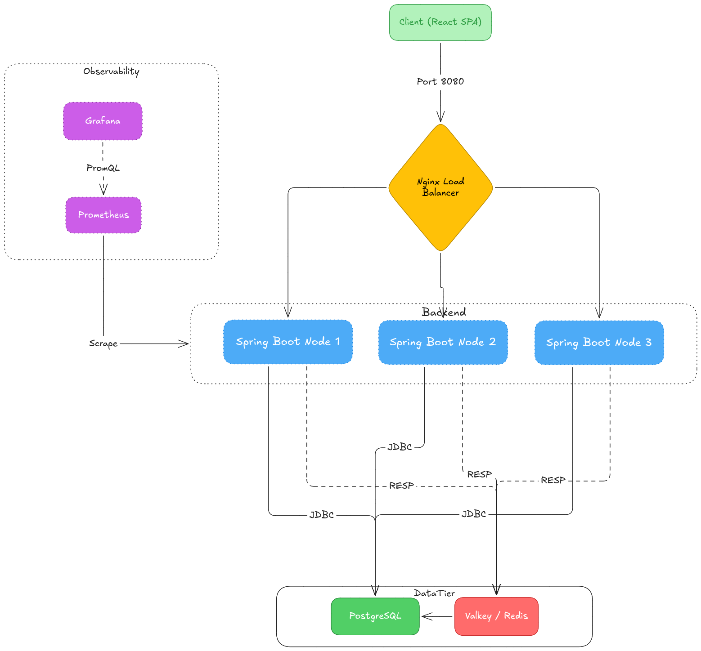

# Industry-Grade URL Shortener Platform

An advanced, full-stack URL shortening platform built for performance, security, and scalability. This project features a robust Spring Boot backend handling analytics and redirection, coupled with a fast, modern React frontend.

## 📸 Application Showcase

### Demo Video
*(Add your demo video here: ``)*

### Screenshots

**Frontend Application**


**Grafana Dashboard**


**Swagger UI**


**Architecture Diagram**


## ✨ Features
- **Secure Authentication:** JWT-based stateless authentication.
- **Advanced Analytics:** Track clicks, geographical locations, and User-Agent data for deep insights.
- **Robust Rate Limiting:** Prevent abuse with Redis-backed rate limiting per IP/user.
- **High Performance Redirection:** Caching layer via Redis for ultra-fast link resolutions.
- **Monitoring & Observability:** Prometheus and Grafana for real-time application metrics.
- **API Documentation:** Interactive Swagger UI documentation via OpenAPI 3.
- **Modern UI:** Responsive, accessible, and stunning frontend built with React, Vite, and Mantine.
- **Production Ready:** Database migrations with Flyway, Dockerized infrastructure, and PostgreSQL.

## 🏗️ Architecture

## 🛠️ Tech Stack

### Backend
- **Framework:** Java 21 & Spring Boot 3
- **Database:** PostgreSQL (with Flyway Migrations)
- **Caching & Rate Limiting:** Redis
- **Security:** Spring Security & JWT
- **Analytics:** MaxMind GeoIP2, UA-Parser

### Frontend
- **Framework:** React 19 & Vite
- **Language:** TypeScript
- **State & Data Fetching:** React Query, Axios
- **UI Components:** Mantine, Tabler Icons
- **Forms & Validation:** React Hook Form, Zod

### Infrastructure & Monitoring
- **Containerization:** Docker & Docker Compose
- **Observability:** Prometheus & Grafana

## 🚀 Getting Started

### Prerequisites
- Java 21
- Node.js 18+
- Docker & Docker Compose

### 1. Clone the repository
```bash
git clone https://github.com/Sarcastic-Soul/springboot-url-shortner.git
cd url_shortner
```

### 2. Environment Variables
Copy `.env.example` to `.env` in the root directory (if available) or create a `.env` file with your database and JWT secrets.

### 3. Start the Entire Platform
The entire platform is fully containerized, including a horizontally scaled backend (3 instances behind Nginx), a React frontend, PostgreSQL, Valkey (Redis), Prometheus, and Grafana.

Simply run:
```bash
docker compose up -d --build
```

### 4. Access the Application
- **Frontend (Web App):** [http://localhost:3000](http://localhost:3000)
- **Backend APIs / Nginx Load Balancer:** [http://localhost:8080](http://localhost:8080)
- **Swagger UI:** [http://localhost:8080/swagger-ui/index.html](http://localhost:8080/swagger-ui/index.html)

## 📂 Project Structure
- `/backend`: Spring Boot application containing all business logic, REST APIs, and database migrations.
- `/frontend`: React SPA with routing and UI components.
- `docker-compose.yml`: Docker Compose configuration for databases and monitoring services.

## 📖 API Documentation (Swagger)
Once the backend is running, you can explore and test the REST APIs using the interactive Swagger UI interface provided by OpenAPI:
- **Swagger UI:** [http://localhost:8080/swagger-ui.html](http://localhost:8080/swagger-ui.html)
- **API Docs (JSON):** [http://localhost:8080/v3/api-docs](http://localhost:8080/v3/api-docs)

## 📊 Monitoring (Grafana & Prometheus)
The application exposes metrics via Spring Boot Actuator which are scraped by Prometheus and automatically visualized in a pre-configured Grafana instance.
1. Run `docker compose up -d`
2. Navigate to Grafana at [http://localhost:3001](http://localhost:3001).
3. **Login credentials:** `admin` / `admin`.
4. Navigate to **Dashboards** -> **Spring Boot Default** folder to view the live JVM Micrometer dashboard. (No manual importing required!)

## 🧪 Testing
The backend is equipped with unit tests built using JUnit 5 and Mockito. To run the test suite:
```bash
cd backend
./mvnw test
```

## 📜 License
This project is licensed under the MIT License.
