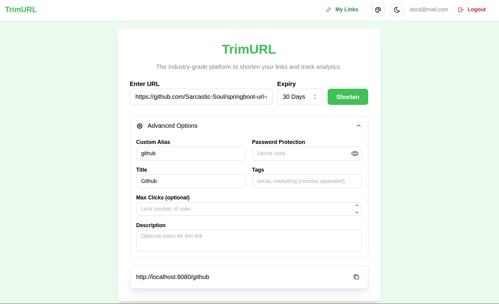
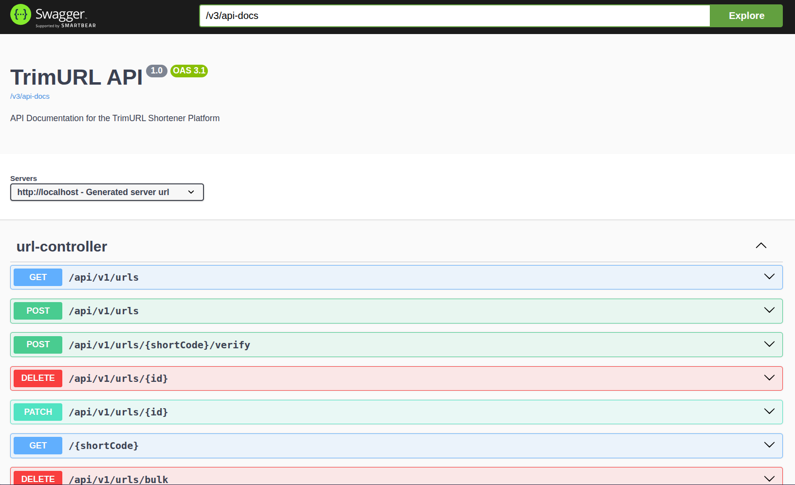
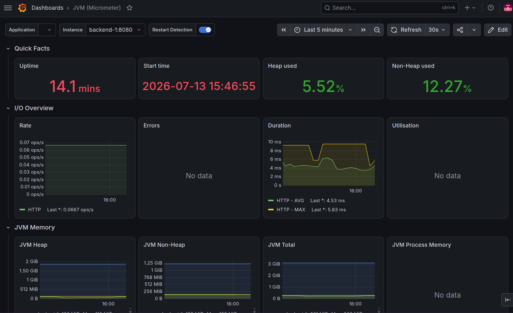
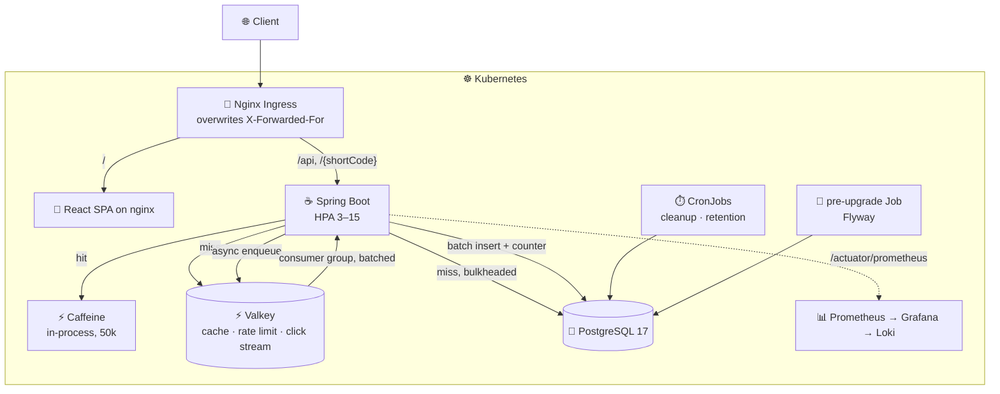

<h1 align="center">⚡ URL Shortener</h1>

<p align="center">
  A cache-first URL shortener built to take load and resist abuse —<br/>
  one Helm chart, three environments, and a load-test suite that attacks it.
</p>

<p align="center">
  
  
  
  
  
  <a href="./chart"></a>
  <a href="./load_tests"></a>
  <a href="./LICENSE"></a>
</p>

---

| Frontend | OpenAPI (Swagger) | Grafana |
| :---: | :---: | :---: |
|  |  |  |

Dashboards are provisioned from [`chart/observability/dashboards`](./chart/observability/dashboards) — a ConfigMap in git, not hand-built in a local cluster.

---

## Architecture



## Core design

| | How it works | Why |
| :-- | :-- | :-- |
| **Cache-first redirects** | Caffeine → Valkey → Postgres, read-through | Hit ratio is *measured* — `X-Cache` header + `redirect_cache_lookups_total` — not assumed |
| **Analytics off the hot path** | Redirect XADDs to a Valkey stream; a consumer group drains it in batches | One existence query + one batched insert + one batched counter update per batch, instead of a write per redirect |
| **Distributed rate limiting** | Token bucket as a single atomic Lua script | Refill and state in one round trip, using Redis's own clock so skewed pods can't disagree |
| **Load shedding** | Resilience4j bulkhead on DB paths, sized from the pool | Past capacity you get an instant `503 + Retry-After`, not a thread parked for 10s that fails anyway |
| **Autoscaling the DB survives** | HPA 3→15, chart *derives* pool size from that ceiling | Scaling out cannot exhaust Postgres — see below |
| **Stateless auth** | JWT carrying the user id as a claim | An authenticated request costs zero DB queries to authenticate |
| **One Valkey, two workloads** | `maxmemory-policy volatile-lru` | Evicts only keys with a TTL: cache and rate-limit keys have one, the click stream doesn't |

## The connection budget

An autoscaler that adds pods adds connection pools. At `pool=50 × maxReplicas=15` peak demand is **750** connections against `max_connections=200` — exhausted at four pods, after which HikariCP blocks for the full timeout and then throws. Scaling out *caused* the failures the autoscaler existed to prevent.

The chart derives the pool instead of accepting it:

```
pool_per_pod = (postgres.maxConnections − reservedConnections) / hpa.maxReplicas
```

| Environment | max_connections | reserved | maxReplicas | pool/pod | peak demand |
| :-- | --: | --: | --: | --: | --: |
| dev | 100 | 10 | 3 | 30 | 96 |
| loadtest | 150 | 20 | 8 | 16 | 134 |
| prod | 200 | 20 | 15 | 12 | 186 |

`helm install` fails if the derived pool drops below 2; CI fails the build if any environment oversubscribes. The bulkhead derives from the same number, so shedding begins where the pool gives out. At larger scale the real answer is PgBouncer in transaction mode — not built.

## Abuse resistance

Rate limiting is the *last* line of defence:

| Layer | Handles | Where |
| :-- | :-- | :-- |
| L3/L4 volumetric | SYN floods, amplification | Provider DDoS scrubbing — not solvable in app code |
| L7 edge | Per-IP request/connection floods | nginx ingress `limit-rps`, `limit-connections` |
| Application | Per-user business quotas | Token bucket over Valkey |
| Load shedding | Degradation past capacity | Bulkhead → fast `503` |

**The client's IP is not the client's choice.** A single [`ClientIpResolver`](backend/src/main/java/com/anish/url_shortener/common/net/ClientIpResolver.java) reads `X-Forwarded-For` only where the chart puts an ingress in front, and takes the **rightmost** hop — the one we appended, not the one the client sent. `forward-headers-strategy` is `none` so the framework can't reintroduce the leftmost read. CI fails the build if any environment trusts the header without an ingress, and [`resilience_test.js`](load_tests/resilience_test.js) floods the service with per-request spoofed headers and asserts they're refused.

## Testing

| Tier | Suite | Trigger | Scale | Answers |
| :-- | :-- | :-- | :-- | :-- |
| **A — Gate** | [`gate_test.js`](load_tests/gate_test.js) | Every PR | 150 VUs, ~2.5 min | Did this change make it worse? |
| **B — Capacity** | [`load_test.js`](load_tests/load_test.js) · `spike` · `soak` | Manual | 1,000–4,000 VUs | How much can it take? |
| **C — Resilience** | [`resilience_test.js`](load_tests/resilience_test.js) | Manual + nightly | Adversarial | Does abuse reach real users? |

Every suite seeds a corpus in `setup()`, then runs **99% redirects / 1% creates** over it with a long-tail access pattern, reporting redirect and create latency separately.

> **No benchmark numbers are published.** The suites were rewritten and no run has been recorded. Numbers from CI will be labelled *constrained single-node* and mean it — one runner hosting KinD, Postgres, Valkey, every pod **and** k6 measures itself as much as the app. See [`BASELINE.md`](load_tests/BASELINE.md).

## Stack

| Layer | Technologies |
| :--- | :--- |
| **Backend** | Java 21, Spring Boot 4.1, Spring Security, Spring Data JPA, Flyway, Resilience4j |
| **Data** | PostgreSQL 17, Valkey 8 (cache · rate limit · streams), Caffeine |
| **Frontend** | React 19, TypeScript, Vite, React Query — served by nginx |
| **Infrastructure** | Docker, Kubernetes, Helm (3 environments), HPA, PDB, CronJobs |
| **Observability** | Micrometer/Prometheus, Grafana (dashboards as code), Loki, prometheus-adapter |
| **Testing** | JUnit 5, Mockito, k6 |

## Quickstart

Full detail in [ENVIRONMENTS.md](./ENVIRONMENTS.md).

```bash
# Local — dependencies in Docker, app on your host
make dev-up          # postgres :5432, valkey :6379
make dev-backend     # profile: local
make dev-frontend

# Cluster
export POSTGRES_PASSWORD="$(openssl rand -base64 32)"
export JWT_SECRET="$(openssl rand -base64 48)"
make prod-deploy
make obs-deploy      # optional: Prometheus + Grafana + Loki

# Benchmarks (needs kind)
make test-up && make test-gate && make test-k6 && make test-down
```

Secrets have no defaults — a missing one fails the install rather than shipping a known password.

| Endpoint | |
| :-- | :-- |
| Frontend | `http://localhost` |
| API | `http://localhost/api/v1` |
| Swagger | `http://localhost/swagger-ui/index.html` |
| Metrics | `http://localhost/actuator/prometheus` |

## Layout

```
backend/               Spring Boot application and Flyway migrations
frontend/              React + Vite SPA, built into an nginx image
chart/                 Helm chart — values-dev / values-loadtest / values-prod
chart/observability/   Prometheus, Grafana, Loki, prometheus-adapter, dashboards
load_tests/            k6 suites: gate, load, spike, soak, resilience
dev/                   docker-compose for local dependencies
.github/workflows/     chart lint, Tier A gate, Tier B capacity, Tier C resilience
```

## License

[MIT](./LICENSE)
