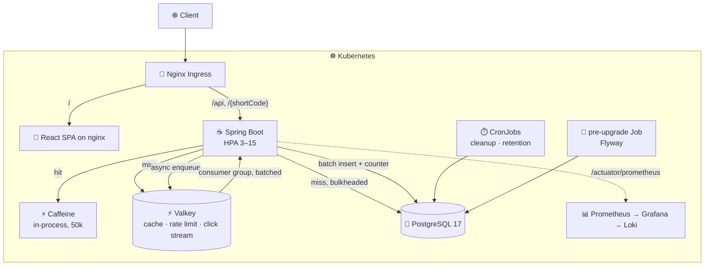

<h1 align="center">⚡ URL Shortener</h1>

<p align="center">
  Shorten a link, protect it, expire it, see who clicked it —<br/>
  on a stack sized to keep serving while it is being abused.
</p>

<p align="center">
  
  
  
  
  
  <a href="./chart"></a>
  <a href="./load_tests"></a>
  <a href="./LICENSE"></a>
</p>

| Frontend | OpenAPI (Swagger) | Grafana |
| :---: | :---: | :---: |
|  |  |  |

---

## What it does

- **Short links** — TSID codes, optional expiry, custom alias
- **Protection** — password-locked links, click limits, unsafe-scheme and domain blocking
- **Analytics** — device, browser, OS and referer per click; IPs stored hashed
- **Accounts** — JWT login, paginated dashboard, edit / delete / bulk-delete
- **Anonymous use** — plain links only, expiry required and capped at 7 days

## Architecture



A redirect reads **Caffeine → Valkey → Postgres**, then publishes the click to a Valkey stream and
returns — no database write on the response path. A consumer group drains that stream and writes
clicks in batches.

Rate limited per identity (20/min anonymous, 200/min authenticated). Database paths sit behind a
bulkhead sized from the connection pool, so overload gets a fast `503` instead of a hung thread.

→ [ARCHITECTURE.md](./ARCHITECTURE.md) for the caching, scaling and load-testing details.

## Quick start

```bash
# Local — dependencies in Docker, app on your host
make dev-up          # postgres :5432, valkey :6379
make dev-backend
make dev-frontend

# Cluster
export POSTGRES_PASSWORD="$(openssl rand -base64 32)"
export JWT_SECRET="$(openssl rand -base64 48)"
make prod-deploy
make obs-deploy      # optional: Prometheus + Grafana + Loki
```

Secrets have no defaults — a missing one fails the install rather than shipping a known password.
Frontend on `http://localhost`, API under `/api/v1`, docs at `/swagger-ui/index.html`, metrics at
`/actuator/prometheus`.

→ [ENVIRONMENTS.md](./ENVIRONMENTS.md) for dev / prod / test setup.

## Benchmarks

Not published yet. The k6 suites (gate / capacity / resilience) run in CI on a constrained
single node, which measures the runner as much as the app — real numbers go in
[`load_tests/BASELINE.md`](load_tests/BASELINE.md) once they are produced on dedicated hardware.

## Stack

| Layer | Technologies |
| :--- | :--- |
| **Backend** | Java 21, Spring Boot 4.1, Spring Security, Spring Data JPA, Flyway, Resilience4j |
| **Data** | PostgreSQL 17, Valkey 8 (cache · rate limit · streams), Caffeine |
| **Frontend** | React 19, TypeScript, Vite, React Query |
| **Infrastructure** | Docker, Kubernetes, Helm (3 environments), HPA, PDB, CronJobs |
| **Observability** | Micrometer/Prometheus, Grafana, Loki |
| **Testing** | JUnit 5, Mockito, k6 |

## Layout

```
backend/               Spring Boot application and Flyway migrations
frontend/              React + Vite SPA, built into an nginx image
chart/                 Helm chart — values-dev / values-loadtest / values-prod
chart/observability/   Prometheus, Grafana, Loki, dashboards
load_tests/            k6 suites: gate, load, spike, soak, resilience
dev/                   docker-compose for local dependencies
.github/workflows/     chart lint, Tier A gate, Tier B capacity, Tier C resilience
```

## License

[MIT](./LICENSE)
