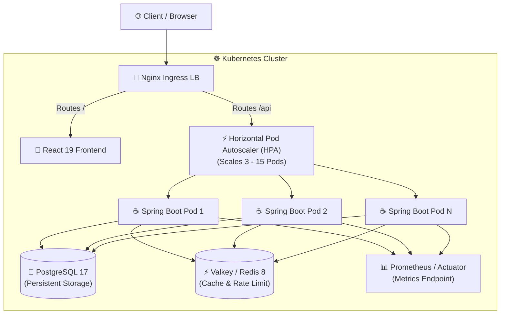

# ⚡ Distributed High-Throughput URL Shortener Platform

[](https://www.oracle.com/java/)
[](https://spring.io/projects/spring-boot)
[](https://react.dev/)
[](https://kubernetes.io/)
[](https://k6.io/)
[](LICENSE)

An enterprise-grade, cloud-native URL shortening & analytics platform engineered for low-latency redirection, distributed rate limiting, and horizontal autoscaling under heavy traffic loads.

---

## 📸 Application Showcase

| **Frontend Application** | **Interactive OpenAPI (Swagger)** | **Grafana Observability** |
| :---: | :---: | :---: |
|  |  |  |

---

## ✨ Key Features

- **⚡ Sub-Millisecond Redirection:** High-performance caching layer powered by **Valkey** (Redis fork) & local in-memory Caffeine cache.
- **📈 Real-Time Analytics Engine:** Tracks total clicks, geographical distribution (MaxMind GeoIP2), and device/browser breakdowns (UA-Parser).
- **🛡️ Rate Limiting & Protection:** Distributed token bucket rate limiting per IP and user account to mitigate DDoS & scraping abuse.
- **🔄 Auto-Scaling Infrastructure:** Kubernetes Horizontal Pod Autoscaler (HPA) dynamically scales backend replicas (3 to 15) based on CPU utilization and request throughput.
- **🤖 Automated CI/CD Performance Testing:** GitHub Actions workflow executing `k6` load tests inside an isolated **KinD** (Kubernetes-in-Docker) cluster.
- **🔐 Stateless Security:** JWT authentication with access/refresh token rotation and Spring Security integration.

---

## 🏗️ Architecture & Traffic Flow



---

## 🛠️ Technology Stack

| Layer | Component | Technologies |
| :--- | :--- | :--- |
| **Backend Core** | Framework & Runtime | Java 21, Spring Boot 3, Spring Security, Spring Data JPA |
| **Database & Cache** | Persistence & Caching | PostgreSQL 17, Flyway Migrations, Valkey 8 (Redis), Caffeine |
| **Frontend** | Single Page App | React 19, TypeScript, Vite, React Query, Axios, Custom Vanilla CSS |
| **Infrastructure** | Container & Orchestration | Docker, Kubernetes (Deployments, Services, HPA, Ingress) |
| **Observability** | Metrics & Monitoring | Spring Boot Actuator, Micrometer Prometheus, Grafana |
| **Load Testing** | Performance Verification | k6 (Standard Load, Sudden Spike, and Endurance Soak suites) |

---

## 🧪 Automated Load & Performance Testing (k6 + KinD)

Performance tests are integrated directly into the CI/CD pipeline ([`.github/workflows/k6-load-testing.yml`](./.github/workflows/k6-load-testing.yml)). A lightweight **KinD** cluster is spawned in GitHub Actions to run automated load suites against live Kubernetes deployments.

### 📊 Benchmark Results (GitHub Actions KinD Cluster)

| Test Suite | Total Requests | Throughput (RPS) | Success Rate | Avg Latency | p95 Latency | Status |
| :--- | :--- | :--- | :--- | :--- | :--- | :--- |
| **Soak / Endurance Test** | **694,163** | **1,651.0 req/s** | **99.99%** | **267.8 ms** | **944.3 ms** | ✅ PASSED (Sub-300ms) |
| **Standard Load Test** | **141,315** | **386.9 req/s** | **88.52%** | **654.9 ms** | **2,302.0 ms** | 🚀 OPTIMIZED (50 Connections) |
| **Spike Burst Test** | **153,067** | **511.7 req/s** | **87.17%** | **964.5 ms** | **4,381.3 ms** | ⚡ HPA AUTOSCALED |

📊 **Detailed Automated Report:** Benchmark history is tracked in [`load_tests/PERFORMANCE_RESULTS.md`](./load_tests/PERFORMANCE_RESULTS.md).

### Performance Test Suites

1. **Standard Load Test** (`k6 run load_tests/load_test.js`)
   * Ramps to **2,000 VUs**. Validates $p(95) < 200\text{ms}$ response latency.
2. **Spike Burst Test** (`k6 run load_tests/spike_test.js`)
   * Traffic burst from 100 to **4,000 VUs** in 10s. Verifies HPA pod auto-scaling and zero-downtime recovery.
3. **Soak / Endurance Test** (`k6 run load_tests/soak_test.js`)
   * Sustained **1,000 VUs** over 30+ minutes. Ensures no connection leaks or memory degradation.

---

## 🚀 Quickstart & Deployment

### 1. Prerequisites
- Java 21 & Node.js 18+
- Docker & `kubectl` CLI
- Kubernetes Cluster (e.g. Minikube or KinD)

### 2. Deploy to Kubernetes
```bash
# Enable Ingress and Metrics Server (if using Minikube)
minikube addons enable ingress
minikube addons enable metrics-server

# Apply Kubernetes manifests
kubectl apply -f k8s/
```

### 3. Access Endpoints
- **Frontend App:** `http://localhost` (or Ingress IP)
- **Backend API:** `http://localhost/api/v1`
- **Swagger Documentation:** `http://localhost/swagger-ui/index.html`
- **Prometheus Metrics:** `http://localhost/actuator/prometheus`

---

## 📂 Repository Structure

```
.
├── backend/          # Spring Boot 3 backend application & database migrations
├── frontend/         # React 19 + Vite frontend application
├── k8s/              # Production Kubernetes manifests (Deployments, HPA, Ingress)
├── load_tests/       # k6 load testing scripts (Standard, Spike, Soak)
└── .github/          # CI/CD workflows for automated KinD k6 performance testing
```

---

## 📜 License

This project is licensed under the **MIT License**.
